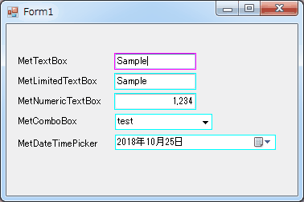
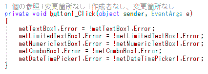
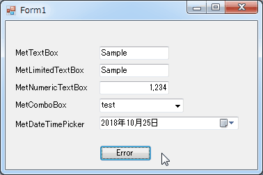

[English](TUTORIAL.md "English")

# チュートリアル

## 目次
- コントロール
  - [背景色を変更したい](#背景色を変更したい)
  - [文字色を変更したい](#文字色を変更したい)
  - [枠色を変更したい](#枠色を変更したい)
  - [エラー時の枠色を変更したい](#エラー時の枠色を変更したい)

## コントロール

## 背景色を変更したい

対象コントロール
- MetTextBox
- MetLimitedTextBox
- MetNumericTextBox
- MetComboBox
- MetDateTimePicker

BaseBackColor, FocusBackColor を利用します。

## 文字色を変更したい

対象コントロール
- MetTextBox
- MetLimitedTextBox
- MetNumericTextBox
- MetComboBox
- MetDateTimePicker

BaseForeColor, FocusForeColor を利用します。

## 枠色を変更したい

対象コントロール
- MetTextBox
- MetLimitedTextBox
- MetNumericTextBox
- MetComboBox
- MetDateTimePicker

BaseOuterFrameColor, FocusOuterFrameColor を利用します。

## エラー時の枠色を変更したい

対象コントロール
- MetTextBox
- MetLimitedTextBox
- MetNumericTextBox
- MetComboBox
- MetDateTimePicker

ErrorOuterFrameColor を利用します。

## ラベルによる読取専用に切り替えたい

対象コントロール
- MetTextBox
- MetLimitedTextBox
- MetNumericTextBox
- MetComboBox
- MetDateTimePicker

ReadOnlyLabel を利用します。

## 読取専用に切り替えたい

対象コントロール
- MetComboBox
- MetDateTimePicker

ReadOnly を利用します。

## 最大入力桁が入力されたらフォーカス遷移したい

MaxLengthの桁数に達したらフォーカス遷移します。

対象コントロール
- MetTextBox
- MetLimitedTextBox
- MetNumericTextBox

> Note:  
MetLimitedTextBox は、MaxByteLength に達した場合もフォーカス遷移します。
MetNumericTextBox は、MinValue または MaxValue または DecimalDigits に達した場合にフォーカス遷移します。

