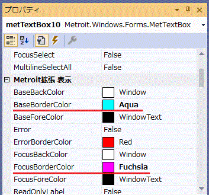

[English](TUTORIAL.md "English")

# チュートリアル

## 目次
- コントロール
  - [Enterでフォーカス移動したい](#Enterでフォーカス移動したい)
  - [Escで入力値をロールバックしたい](#Escで入力値をロールバックしたい)
  - [Escでフォーカスを外したい](#Escでフォーカスを外したい)
  - [Escでフォームを閉じたい](#Escでフォームを閉じたい)
  - [Escの動作を組み合わせたい](#Escの動作を組み合わせたい)
  - [背景色を変更したい](#背景色を変更したい)
  - [文字色を変更したい](#文字色を変更したい)
  - [枠色を変更したい](#枠色を変更したい)
  - [エラー時の枠色を変更したい](#エラー時の枠色を変更したい)
  - [Labelによる読取専用に切り替えたい](#Labelによる読取専用に切り替えたい)
  - [TextBoxによる読取専用に切り替えたい](#TextBoxによる読取専用に切り替えたい)
  - [最大入力桁が入力されたらフォーカス遷移したい](#最大入力桁が入力されたらフォーカス遷移したい)
  - [フォーカスを得た時に文字列を反転させたい](#フォーカスを得た時に文字列を反転させたい)
  - [複数行入力エディット時にCtrl+Aを有効にしたい](#複数行入力エディット時にCtrl+Aを有効にしたい)
  - [テキストに候補を表示したい](#テキストに候補を表示したい)
  - [特定の文字だけ入力を許可したい](#特定の文字だけ入力を許可したい)
  - [数値表現の入力を行いたい](#数値表現の入力を行いたい)
  - [日付項目にNullを許可したい](#日付項目にNullを許可したい)

## コントロール

## Enterでフォーカス移動したい

対象コントロール
- MetForm

EnterFocus を利用します。  
Shift+Enter でフォーカスを戻します。  
ボタンはフォーカス移動しません。


## Escで入力値をロールバックしたい

対象コントロール
- MetForm

EscPush を利用します。  
ControlRollback を有効にすると、入力値をロールバックできます。
コードしない場合にロールバックできるコントロールは以下です。
  - MetTextBox
  - MetLimitedTextBox
  - MetNumericTextBox
  - MetComboBox
  - MetDateTimePicker


自分でコードする場合は、どんなコントロールにも対応できます。  
また、DataGridViewTextBoxEditingControl などのように、この動作を嫌うオブジェクトの場合は動作させないこともできます。

ControllRollbacking イベントでロールバック動作を嫌うオブジェクトを拒否し、IControlRollback インターフェースでロールバックの値を制御します。

```C#:SampleCode
public partial class Form1 : MetForm, IControlRollback
{
    public Form1()
    {
        InitializeComponent();
    }

    private CheckState prevCheckState;

    private void checkBox1_Enter(object sender, EventArgs e)
    {
        // 変更前の状態を保持しておく
        this.prevCheckState = checkBox1.CheckState;
    }

    private void Form1_ControlRollbacking(object sender, CancelEventArgs e)
    {
        // DataGridView のオブジェクトは、標準動作でロールバックさせる
        var control = this.ActiveControl;
        if (control is DataGridViewTextBoxEditingControl || control is DataGridViewComboBoxEditingControl)
        {
            e.Cancel = true;
        }
    }

    public bool IsRollbacked(object sender, Control control)
    {
        // チェックボックスのステートが変化していない時はロールバック済みとする
        if (control is CheckBox && checkBox1.CheckState == this.prevCheckState)
        {
            return true;
        }

        //// ControlRollbacking の記述をここで行い、ロールバックされたものみなしてもよい
        //// DataGridView のオブジェクトは、標準動作でロールバックさせる
        //if (control is DataGridViewTextBoxEditingControl || control is DataGridViewComboBoxEditingControl)
        //{
        //    return true;
        //}

        return false;   
    }

    public void Rollback(object sender, Control control)
    {
        // チェックボックスのステートをロールバックする
        if (control is CheckBox)
        {
            checkBox1.CheckState = this.prevCheckState;
        }
    }
}
```


## Escでフォーカスを外したい

対象コントロール
- MetForm

EscPush を利用します。  
ControlLeave を有効にすると、フォーカスを外すことができます。
コードしない場合にフォーカスを外すことができるコントロールは以下です。
  - MetTextBox
  - MetLimitedTextBox
  - MetNumericTextBox
  - MetComboBox
  - MetDateTimePicker


自分でコードする場合は、どんなコントロールにも対応できます。  
また、DataGridViewTextBoxEditingControl などのように、この動作を嫌うオブジェクトの場合は動作させないこともできます。

ControllLeaving イベントでロールバック動作を嫌うオブジェクトを拒否します。

```C#:SampleCode
private void Form1_ControlLeaving(object sender, CancelEventArgs e)
{
    // DataGridView のオブジェクトは、標準動作でフォーカスアウトさせる
    var control = this.ActiveControl;
    if (control is DataGridViewTextBoxEditingControl || control is DataGridViewComboBoxEditingControl)
    {
        e.Cancel = true;
    }
}
```


## Escでフォームを閉じたい

対象コントロール
- MetForm

EscPush を利用します。  
FormClose を有効にすると、フォームを閉じることができます。


## Escの動作を組み合わせたい

対象コントロール
  - MetForm

EscPush の値を組み合わせて利用します。  
発生順序は以下のようになります。
  1. ControlRollback
  1. ControlLeave
  1. FormClose

## 背景色を変更したい

対象コントロール
- MetTextBox
- MetLimitedTextBox
- MetNumericTextBox
- MetComboBox
- MetDateTimePicker

BaseBackColor, FocusBackColor を利用します。


## 文字色を変更したい

対象コントロール
- MetTextBox
- MetLimitedTextBox
- MetNumericTextBox
- MetComboBox
- MetDateTimePicker

BaseForeColor, FocusForeColor を利用します。


## 枠色を変更したい

対象コントロール
- MetTextBox
- MetLimitedTextBox
- MetNumericTextBox
- MetComboBox
- MetDateTimePicker

BaseBorderColor, FocusBorderColor を利用します。  
TexBox系の各コントロールは、BorderStyle=FixedSingle でないと動作しません。




## エラー時の枠色を変更したい

対象コントロール
- MetTextBox
- MetLimitedTextBox
- MetNumericTextBox
- MetComboBox
- MetDateTimePicker

ErrorBorderColor を利用します。  
TexBox系の各コントロールは、BorderStyle=FixedSingle でないと動作しません。

```C#:SampleCode
private void button1_Click(object sender, EventArgs e)
{
    metTextBox1.Error = !metTextBox1.Error;
    metLimitedTextBox1.Error = !metLimitedTextBox1.Error;
    metNumericTextBox1.Error = !metNumericTextBox1.Error;
    metComboBox1.Error = !metComboBox1.Error;
    metDateTimePicker1.Error = !metDateTimePicker1.Error;
}
```


## Labelによる読取専用に切り替えたい

対象コントロール
- MetTextBox
- MetLimitedTextBox
- MetNumericTextBox
- MetComboBox
- MetDateTimePicker

ReadOnlyLabel を利用します。

```C#:SampleCode
private void button1_Click(object sender, EventArgs e)
{
    metTextBox1.ReadOnlyLabel = !metTextBox1.ReadOnlyLabel;
    metLimitedTextBox1.ReadOnlyLabel = !metLimitedTextBox1.ReadOnlyLabel;
    metNumericTextBox1.ReadOnlyLabel = !metNumericTextBox1.ReadOnlyLabel;
    metComboBox1.ReadOnlyLabel = !metComboBox1.ReadOnlyLabel;
    metDateTimePicker1.ReadOnlyLabel = !metDateTimePicker1.ReadOnlyLabel;
}
```


## TextBoxによる読取専用に切り替えたい

対象コントロール
- MetComboBox
- MetDateTimePicker

ReadOnly を利用します。

```C#:SampleCode
private void button1_Click(object sender, EventArgs e)
{
    metComboBox1.ReadOnly = !metComboBox1.ReadOnly;
    metDateTimePicker1.ReadOnly = !metDateTimePicker1.ReadOnly;
}
```


## 最大入力桁が入力されたらフォーカス遷移したい

対象コントロール
- MetTextBox
- MetLimitedTextBox
- MetNumericTextBox

MetTextBox は、以下でフォーカス遷移します。  
>  - MaxLength の桁数に達した時。  

MetLimitedTextBox は、以下のいずれかでフォーカス遷移します。  
>  - MaxLength の桁数に達した時。  
>  - MaxByteLength に達した時。(ByteEncoding で指定したエンコーディングを基準とする。)  

MetNumericTextBox は、以下のいずれかでフォーカス遷移します。  
>  - MaxValue または MinValue と合致する値の時。  
>  - MaxValue または MinValue の桁数に達した時。(DecimalDigits = 0 の時)  
>  - DecimalDigits の桁数に達した時。  

```C#:SampleCode
public Form1()
{
    InitialzeComponent();

    // sample properties
    metTextBox1.MaxLength = 6;

    metLimitedTextBox1.MaxLength = 32767;
    metLimitedTextBox1.MaxByteLength = 6;

    metNumericTextBox1.MaxValue = 9999;
    metNumericTextBox1.MinValue = -9999;
    metNumericTextBox1.DecimalDigits = 0;
}
```


## フォーカスを得た時に文字列を反転させたい

対象コントロール
- MetTextBox
- MetLimitedTextBox
- MetNumericTextBox

FocusSelect を利用します。


## 複数行入力エディット時にCtrl+Aを有効にしたい

対象コントロール
- MetTextBox
- MetLimitedTextBox

MultilineSelectAll を利用します。


## テキストに候補を表示したい

対象コントロール
- MetTextBox
- MetLimitedTextBox
- MetNumericTextBox

CustomAutoCompleteMode, CustomAutoCompleteKeys, CustomAutoCompleteBox を組み合わせて利用します。

|             | CustomAutoCompleteMode                                              |
|-------------|---------------------------------------------------------------------|
| None        | 利用しない                                                          |
| Keys        | CustomAutoCompleteKeys に指定されたキーを押下した時に候補を表示する |
| Suggest     | 一致する文字が入力された時に候補を表示する                          |
| KeysSuggest | Keys および Suggest の両方を利用する                                |

CustomAutoCompleteKeys  
　候補を表示するキー操作を複数指定します。  
　デフォルトはコンボボックスの操作と同じです。

|             | CustomAutoCompleteBox                                                                         |
|-------------|-----------------------------------------------------------------------------------------------|
| CompareOptions   | [System.Globalization.CompareOptions](https://docs.microsoft.com/ja-jp/dotnet/api/system.globalization.compareoptions?redirectedfrom=MSDN&view=netframework-4.7.2) を指定する。<br>候補対象を抽出する時の比較オプションです。 |
| DataSource       | 候補のデータソース。<br>DataSet, DataTable, IList オブジェクトが指定可能です。           |
| DisplayMember    | データソースの表示項目名。                                                               |
| MatchPattern     | StartWith：前方一致。<br>EndWith：後方一致。<br>Partial：部分一致。<br>Equal：完全一致。 |
| MaxDropDownItems | スクロールせず表示する候補の個数。                                                       |
| ValueMember      | データソースの値項目名。                                                                 |

```C#:SampleCode
private void setupDataSource()
{
    var dt = new System.Data.DataTable();
    dt.Columns.Add("Column1");
    dt.Columns.Add("Column2");

    var row = dt.NewRow();
    row["Column1"] = "aaa column1";
    row["Column2"] = "aaa column1 Value";
    dt.Rows.Add(row);
    row = dt.NewRow();
    row["Column1"] = "bbb column1";
    row["Column2"] = "bbb column1 Value";
    dt.Rows.Add(row);
    row = dt.NewRow();
    row["Column1"] = "ccc column1";
    row["Column2"] = "ccc column1 Value";
    dt.Rows.Add(row);
    row = dt.NewRow();
    row["Column1"] = "aaA column1";
    row["Column2"] = "aaA column1 Value";
    dt.Rows.Add(row);
    row = dt.NewRow();
    row["Column1"] = "文字カナa column1";
    row["Column2"] = "文字カナa column1 Value";
    dt.Rows.Add(row);
    row = dt.NewRow();
    row["Column1"] = "文字ｶﾅA column1";
    row["Column2"] = "文字ｶﾅA column1 Value";
    dt.Rows.Add(row);
    row = dt.NewRow();
    row["Column1"] = "文字かなA column1";
    row["Column2"] = "文字かなA column1 Value";
    dt.Rows.Add(row);
    row = dt.NewRow();
    row["Column1"] = "文字かなAB column1";
    row["Column2"] = "文字かなAB column1 Value";
    dt.Rows.Add(row);
    row = dt.NewRow();
    row["Column1"] = "文字かなAC column1B";
    row["Column2"] = "文字かなAC column1B Value";
    dt.Rows.Add(row);

    metTextBox1.CustomAutoCompleteBox.DataSource = dt;
}

private void metTextBox1_TextChanged(object sender, EventArgs e)
{
    textBox1.Text = metTextBox1.CustomAutoCompleteBox.SelectedValue?.ToString();
}
```


## 特定の文字だけ入力を許可したい

対象コントロール
- MetLimitedTextBox

AcceptsChar, ExcludeChars, FullSignSpecialChars, CustomChars を組み合わせて利用します。

|             | AcceptsChar              |
|-------------|--------------------------|
| All         | すべての文字を許可する。 |
| HalfNumeric | 半角数字を許可する。     |
| FullNumeric | 全角数字を許可する。     |
| HalfAlpha   | 半角英字を許可する。     |
| FullAlpha   | 全角英字を許可する。     |
| HalfSign    | 半角記号を許可する。     |
| FullSign    | 全角記号を許可する。     |
| Custom      | 指定文字のみを許可する。 |

> Notes:  
> AcceptsChar≠All, Custom の時、ExcludeChars に指定された文字は許可されません。  
> AcceptsChar=FullSign の時、FullSpecialChars に指定された文字も許可されます。(主に各国特有の記号)  
> AcceptsChar=Custom の時、CustomChars に指定された文字のみ許可されます。


## 数値表現の入力を行いたい

対象コントロール
- MetNumericTextBox

いくつかのプロパティを組み合わせて利用します。

| プロパティ       |                                                     |
|------------------|-----------------------------------------------------|
| AcceptNegative   | マイナス値を許可するかどうか。                      |
| AcceptNull       | Null値を許可するかどうか。                          |
| CurrencySymbol   | Mode=Currency の時の記号。                          |
| DecimalDigits    | 許可する小数桁数。                                  |
| DecimalSeparator | 整数部と小数部の区切り文字。                        |
| GroupSeparator   | 整数部の桁区切り文字。                              |
| GroupSizes       | 整数部の桁区切りを実施する位置。                    |
| MaxValue         | 入力可能な最大値。                                  |
| MinValue         | 入力可能な最小値。                                  |
| NegativePattern  | マイナス値の時の表現方法。                          |
| NegativeSign     | マイナス値の記号。                                  |
| PercentSymbol    | Mode=Percent の時の記号。                           |
| PositivePattern  | プラス値の時の表現方法。                            |
| Mode             | Numeric=数値<br>Currency=通貨<br>Percent=パーセント |
| Value            | 入力されている数値。                                |

例：小数2桁までのパーセントで、マイナス値を許可しない、Nullを許可する時


## 日付項目にNullを許可したい

対象コントロール
- MetDateTimePicker

AcceptNull を利用します。


